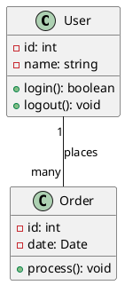
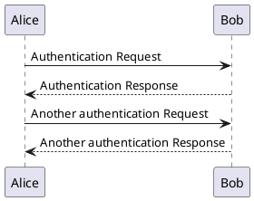
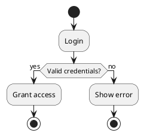

# OI OS Integration Guide for OI-uml-mcp

This guide provides complete instructions for AI agents to install, configure, and use the OI-uml-mcp server in OI OS (Brain Trust 4).

## 🚀 Installation

### Prerequisites

| Requirement | Version        |
| ----------- | -------------- |
| **Python**  | 3.10 or higher |
| **uv**      | Latest (recommended) or pip |
| **Git**     | Any            |

### Installation Steps

1. **Clone the repository:**
   ```bash
   git clone https://github.com/OI-OS/OI-uml-mcp.git
   ```

2. **Navigate to the server directory:**
   ```bash
   cd MCP-servers/OI-uml-mcp
   ```

3. **Install dependencies:**
   ```bash
   # Using uv (recommended)
   uv sync
   
   # Or using pip
   pip install -r requirements.txt
   ```

4. **Connect the server to OI OS:**
   ```bash
   cd ../../ # Go back to the OI OS root directory
   ./brain-trust4 connect OI-uml-mcp uv -- run --directory "$(pwd)/MCP-servers/OI-uml-mcp" python mcp_server.py run
   ```

## 🔧 Configuration

### Environment Variables

- `PLANTUML_SERVER`: PlantUML server URL (default: `http://www.plantuml.com/plantuml`)
- `UML_MCP_OUTPUT_DIR`: Directory to save generated diagrams (default: `./output`)

**Example:**
```bash
export PLANTUML_SERVER="http://www.plantuml.com/plantuml"
export UML_MCP_OUTPUT_DIR="./output"
```

### Local PlantUML Server (Optional)

For local development or offline use, you can run a local PlantUML server:

```bash
docker run -d -p 8080:8080 plantuml/plantuml-server
export PLANTUML_SERVER="http://localhost:8080"
```

## 📋 Creating Intent Mappings

Intent mappings connect natural language keywords to specific MCP server tools.

**SQL to create intent mappings:**

```sql
BEGIN TRANSACTION;

-- Intent mappings for OI-uml-mcp
INSERT OR REPLACE INTO intent_mappings (keyword, server_name, tool_name, priority) VALUES
('generate uml', 'OI-uml-mcp', 'generate_uml', 10),
('create uml diagram', 'OI-uml-mcp', 'generate_uml', 10),
('uml diagram', 'OI-uml-mcp', 'generate_uml', 10),
('generate diagram', 'OI-uml-mcp', 'generate_uml', 10),
('create diagram', 'OI-uml-mcp', 'generate_uml', 10),
('plantuml', 'OI-uml-mcp', 'generate_uml', 10),
('class diagram', 'OI-uml-mcp', 'generate_uml', 10),
('sequence diagram', 'OI-uml-mcp', 'generate_uml', 10),
('activity diagram', 'OI-uml-mcp', 'generate_uml', 10),
('use case diagram', 'OI-uml-mcp', 'generate_uml', 10),
('state diagram', 'OI-uml-mcp', 'generate_uml', 10),
('component diagram', 'OI-uml-mcp', 'generate_uml', 10),
('deployment diagram', 'OI-uml-mcp', 'generate_uml', 10),
('object diagram', 'OI-uml-mcp', 'generate_uml', 10);

COMMIT;
```

## 📝 Creating Parameter Rules

Parameter rules define which fields are required and how to extract them from natural language queries.

**SQL to create parameter rules:**

```sql
BEGIN TRANSACTION;

-- Parameter rules for OI-uml-mcp
INSERT OR REPLACE INTO parameter_rules (server_name, tool_name, tool_signature, required_fields, field_generators, patterns) VALUES
('OI-uml-mcp', 'generate_uml', 'OI-uml-mcp::generate_uml', '["diagram_type", "code"]',
 '{"diagram_type": {"FromQuery": "OI-uml-mcp::generate_uml.diagram_type"}, "code": {"FromQuery": "OI-uml-mcp::generate_uml.code"}}', '[]');

COMMIT;
```

## 🔍 Parameter Extractors

Add these patterns to `parameter_extractors.toml.default`:

```toml
# ============================================================================
# OI-uml-mcp
# ============================================================================

# UML Diagram Generation
"OI-uml-mcp::generate_uml.diagram_type" = "regex:(?:diagram[\\s_-]?type|type)[\\s:]+(class|sequence|activity|usecase|state|component|deployment|object)"
"OI-uml-mcp::generate_uml.code" = "remove:generate,create,uml,diagram,plantuml"
```

## 🛠️ Available Tools (1 tool)

### Diagram Generation

1. **`generate_uml`** - Generate a UML diagram using PlantUML
   - **Parameters:**
     - `diagram_type` (required, string): Type of diagram (class, sequence, activity, usecase, state, component, deployment, object)
     - `code` (required, string): PlantUML code for the diagram

   **Note:** The current implementation uses a simplified server with one universal tool. The `diagram_type` parameter is accepted but not strictly validated - any PlantUML code will work.

## 📋 Supported Diagram Types

The server supports all standard UML diagram types through PlantUML:

- **Class Diagram** - Shows classes, attributes, methods, and relationships
- **Sequence Diagram** - Shows interactions between objects over time
- **Activity Diagram** - Shows workflows and business processes
- **Use Case Diagram** - Shows actors and use cases
- **State Diagram** - Shows state transitions
- **Component Diagram** - Shows system components and dependencies
- **Deployment Diagram** - Shows system deployment architecture
- **Object Diagram** - Shows object instances and relationships

## 💡 Usage Examples

### Natural Language Queries

```bash
# Generate a class diagram
./oi "generate uml class diagram with code @startuml class User @enduml"

# Generate a sequence diagram
./oi "create sequence diagram showing user login flow"

# Generate any UML diagram
./oi "generate uml diagram type class code @startuml class Order @enduml"
```

### Direct Calls

```bash
# Generate a class diagram
./brain-trust4 call OI-uml-mcp generate_uml '{
  "diagram_type": "class",
  "code": "@startuml\nclass User {\n  -name: string\n  +login()\n}\n@enduml"
}'

# Generate a sequence diagram
./brain-trust4 call OI-uml-mcp generate_uml '{
  "diagram_type": "sequence",
  "code": "@startuml\nAlice -> Bob: Hello\nBob -> Alice: Hi\n@enduml"
}'
```

### PlantUML Code Examples

**Class Diagram:**


**Sequence Diagram:**


**Activity Diagram:**


## 🚨 Important Notes

### PlantUML Code Format

- All PlantUML code must be wrapped in `@startuml` and `@enduml` tags
- The server will automatically add these tags if they're missing in the simplified version
- PlantUML syntax is case-sensitive

### Output Format

The server returns:
- **URL**: Direct link to view the diagram online
- **Code**: The PlantUML code used to generate the diagram
- **Format**: Output format (default: SVG)

### Network Requirements

- The server requires internet access to use the default PlantUML server (`http://www.plantuml.com/plantuml`)
- For offline use, set up a local PlantUML server using Docker

## 📖 Additional Resources

- **GitHub Repository:** https://github.com/OI-OS/OI-uml-mcp
- **Original Repository:** https://github.com/antoinebou12/uml-mcp
- **PlantUML Documentation:** https://plantuml.com/
- **PlantUML Syntax Guide:** https://plantuml.com/guide

## 🚨 Known Issues

### Parameter Extraction

**Issue:** Natural language queries may not extract PlantUML code correctly due to parameter engine limitations.

**Status:** ⚠️ **Known limitation** - The parameter engine may pass extractor key names as literal values.

**Workaround:** Use direct calls for reliable results:

```bash
# Direct call (recommended)
./brain-trust4 call OI-uml-mcp generate_uml '{
  "diagram_type": "class",
  "code": "@startuml\nclass User {\n  -name: string\n  +login()\n}\n@enduml"
}'
```

**Note:** This is a known limitation of the OI OS parameter engine and affects multiple servers. A universal fix is planned.

## ✅ Verification

After installation, verify the server is working:

```bash
# List tools
./brain-trust4 tools OI-uml-mcp

# Test diagram generation (direct call)
./brain-trust4 call OI-uml-mcp generate_uml '{
  "diagram_type": "class",
  "code": "@startuml\nclass Test\n@enduml"
}'
```

If the direct call works, the server is successfully installed and configured!

